# Shark Attacks dataset analysis
## By: Nicolas Blasi

## <b> In this project, we were asked to clean and do exploratory data analysis on the Kaggle Shark attacks dataset using mainly Pandas, Seaborn and Matplotlib.
 
 
 

-----------------------------------------------------------------------------------------------------------------------------------------------------------------------------------------------------------------------------------------
-----------------------------------------------------------------------------------------------------------------------------------------------------------------------------------------------------------------------------------------

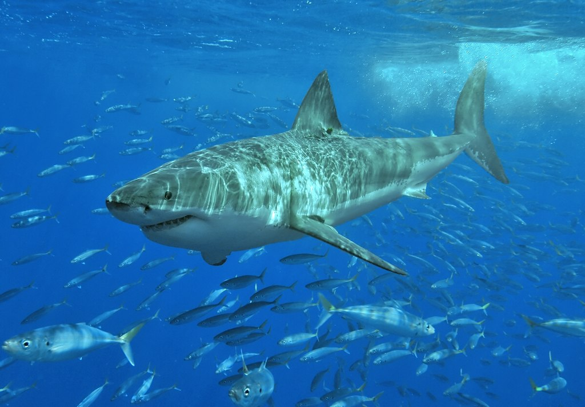

-----------------------------------------------------------------------------------------------------------------------------------------------------------------------------------------------------------------------------------------
-----------------------------------------------------------------------------------------------------------------------------------------------------------------------------------------------------------------------------------------

 

## <b>Hypothesis 1:<b> "Provoked attacks have a higher death ratio than unprovoked and, considering there are 20% more attacks after the 12 AM, the time of attack affects the distribution"
## <b>Hypothesis 2:<b> "The most aggresive specie has the highest kill ratio"
## <b>Hypothesis 3:<b> "Attacks happen mostly when the weather is hot, having Swimming and Surfing as the most common activities linked to shark attacks"

 

 

## Set up:

 
 

### 1- Dataset Cleaning

 

After exploring the dataset, taking into account quality and size, i proceeded to remove unnecesary atributes of the table and null rows.

The Jupyter notebook has documentation, sharing step by step the code and criteria used to clean the data.

The notebook exports attacks_clean.csv, used by the exploratory data analysis (EDA) notebook.

 

### 2- EDA (Exploratory Data Analysis)
 

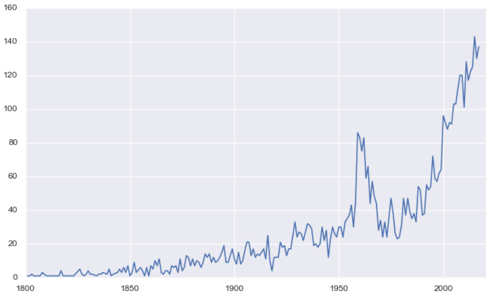

- Attacks registries have increased steadily during the last 200 years, with a spike on 1970 

   

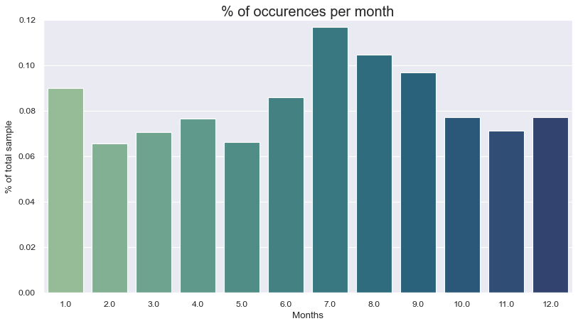

- July accumulates most occurences, although splitting cases considering hemispheres seems reasonable.

   

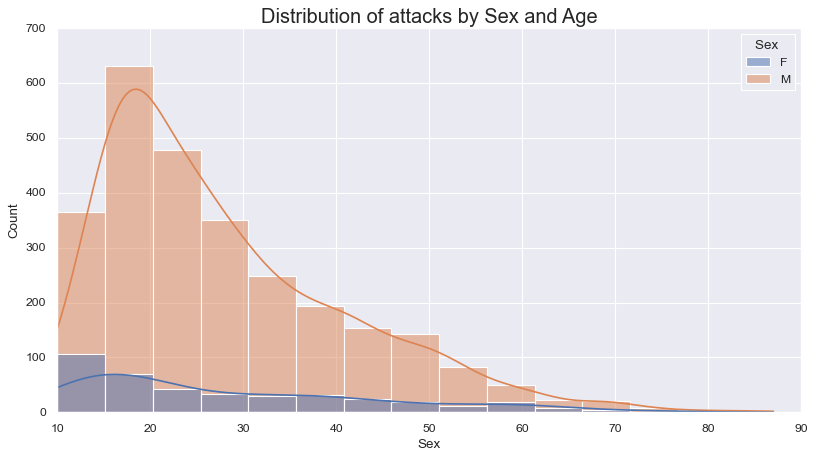

- Victims are predominantly male, showing a distribution with right skew when analyzing the age of the victims 

   

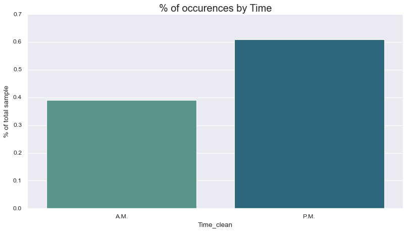

- Attacks with the time mapped happen mostly after 12 AM.

-----------------------------------------------------------------------------------------------------------------------------------------------------------------------------------------------------------------------------------------
-----------------------------------------------------------------------------------------------------------------------------------------------------------------------------------------------------------------------------------------

  

# <b>Hypothesis 1:<b> "Provoked attacks have a higher death ratio than unprovoked and, considering there are 20% more attacks after the 12 AM, the time of attack affects the distribution considerably"

  

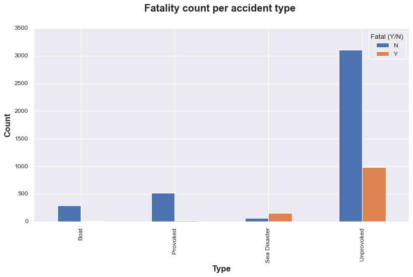

- The unprovoked attack type is clearly the predominant type of the sample

    
### Are provoked attacks deadlier? Does the time day affect the distribution?
 

- Considering that the time of the day is representative for 50% of the sample only (50% were not mapped/nulls), i plotted the distribution of all cases, in addition of the ones that occured before or after 12 AM.

- Unprovoked attacks prove to be higher than provoked attacks, proving this hypothesis to be False. Its worth noting that the Sea disaster death ratio is almost 3 times the unprovoked attacks one. Although it can't be proven using this dataset, its reasonable to assume its due to longer exposure to the danger. 

- Other than Sea Disaster, which has %5 more attacks during the afternoon/night relative to the morning, the death rate per attack type does not vary noticeably for most of attack types relative to the time of the attack.

  

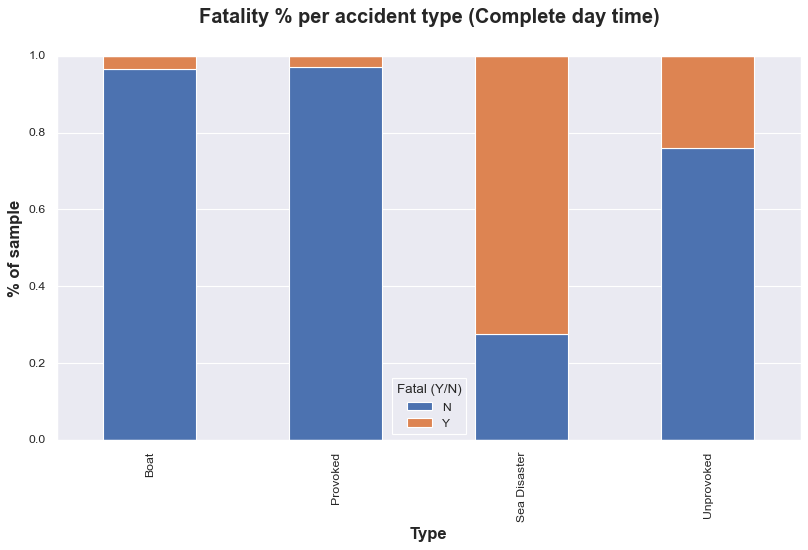

  

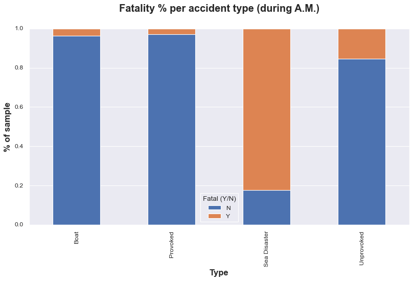

  

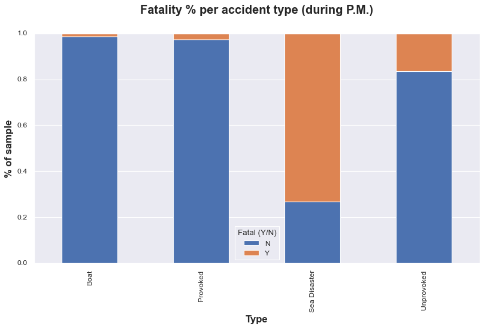

  

## <b>Result:  Unprovoked attacks have a higher death rate, and its distribution is not clearly impacted by the time of the attack , according to this sample

  

# <b>Hypothesis 2:<b> "The most aggresive specie has the highest kill ratio"

  

### What are the top 5 most aggressive/most recurring specie identified?

- Grouped unidentified species and species with less than 1% of occurences in the "other/NA" category, which won't be considered for this analysis
- The white shark is the clear winner, doubling the occurences of the tiger shark.

  

### Which top 5 specie is the most deadly?

 

- Although it could technically be a tie, the Tiger shark is the winner (proving the hypothesis False), with the white shark as the runner up followed closely by the bull shark.
- It is relevant to consider than more that 80% of the shark specie was not specified. It could be possible that the white shark is the easiest to spot, hence the one most identified

  

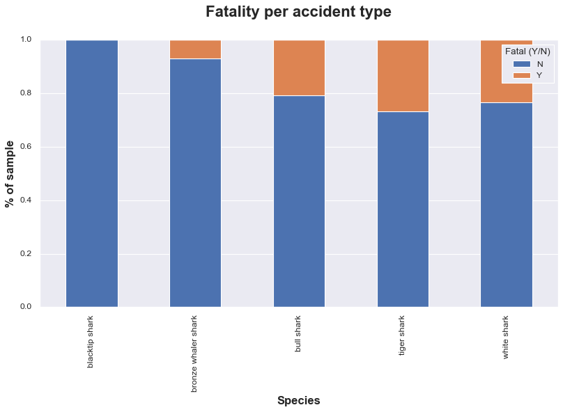

  

## <b> Conclusion: The white shark (Most aggresive specie) is not the deadliest, according to this sample<b>

  

# <b>Hypothesis 3:<b> "Attacks happen mostly when the weather is hot, having Swimming and Surfing as the most common activities linked to shark attacks"

 

## Sampling countries: What are the top 5 Countries? is the % of events relevant?

- Usa, Australia, South Africa, New Zealand and Brazil make the top 5 countries with most shark attacks in the sample.
- This subset makes up 72% of the sampled cases, making it relevant for analysis.

 

## What are the top 5 Activities? is the % of events relevant?

- Other category: i grouped 17% of Nulls and all activities with a % less than 1%, resulting in category other, 30% of the sample.
- The top 10 mapped activities (not including "other") represent 50%.
- The mix of activities depend on each country, although Swimming and Surfing are the top activities linked to the attacks.
- Its visible that USA and Australia are the countries most affected by shark attacks.

 

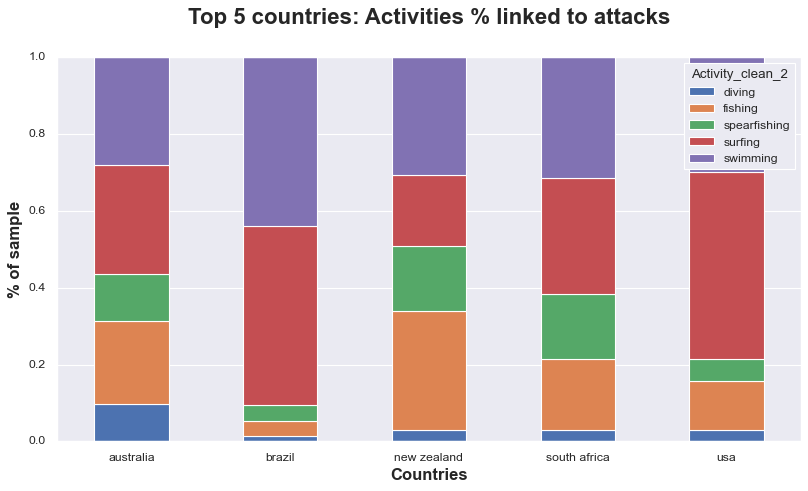

  

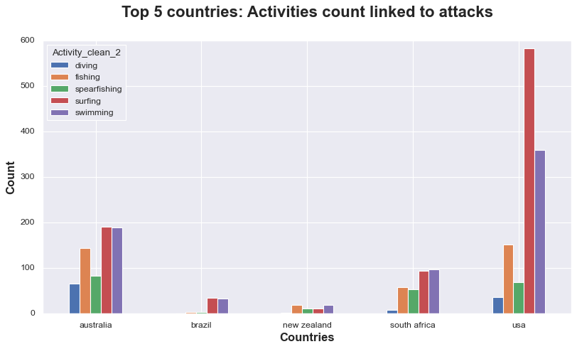

  
## Do attacks happen mostly when the weather is hot? Is this valid across the top 5 activities?

- After grouping the north and south hemisphere top countries and analyzing the distribution of attacks during the year, its reasonable to say that attacks happen with more frequency during hot months.
- This applies across all activities, We have evidence that supports this hypothesis.

 

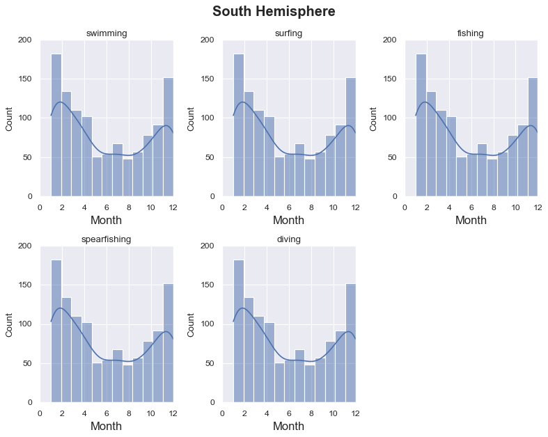

  

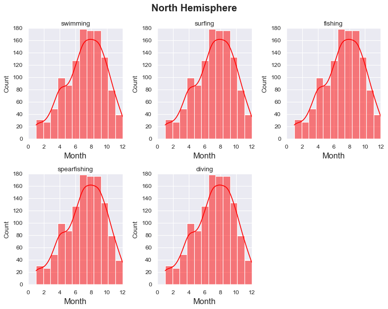

  

## <b>Conclusion:   There's evidence that attacks happen mostly during hot months, with surfing and swimming as the main activities behind the attacks, according to this sample<b>